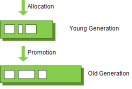

# Java: Garbage Collection 개념 및 동작 원리

# 1. Garbage Collection (가비지 컬렉션)이란?

프로그램 개발 시 유효하지 않는 메모리인 가비지가 발생하게 된다. C언어를 이용하면 직접 free() 함수를 통해 직접 메모리 해제를 해줘야한다. 하지만 Java 나 Kotlin을 이용해 개발을 하다보면 개발자가 메모리를 직접 해제해주는 일이 없다.

그이유는 **JVM**의 가비지 컬렉터가 불필요한 메모리를 알아서 정리 해주기 때문이다.(어떻게 정리?) 대신 Java에서 명시적으로 불필요한 데이터를 표현하기 위해서는 일반적으로 null을 선언해준다.

```kotlin
Person person = new Person();
person.setName("Mang");
person = null;

// 가비지 발생
person = new Person();
person.setName("MangKyu");
```

가비지 컬렉터(Garbage Collector, GC) 가 주기적으로 검사하여 메모리를 정리해준다.

물론 Java에서 System.gc()를 통해 GC호출이 가능하지만, 시스템에 매우 큰 영향을 미치므로 절대 호출해서는 안된다고 한다.

## 1.1. Minor GC 와 Majot GC

JVM의 Heap 영역은 처음 설계될 때 다음의 2가지를 전제로 설계되었다.

- 대부분의 객체는 금방 접근 불가능한 상태가 된다.
- 오래된 객체에서 새로운 객체로의 참조는 아주 적게 존재한다.

즉, 객체는 대부분 일회성이 되며, 메모리에 오랫동안 남는 경우는 드물다고 가정한 것이다.

그래서 객체의 생존기간에 따라 물리적인 Heap 영역을 나누게 된다. 바로 Young, Old 영역 2가지로 설계되었다. (초기엔 Perm 영역있었지만 Java8부터 제거)



GC의 영역과 흐름

- Young 영역 (Young Generation)
    - 새롭게 생성된 객체가 할당 되는 영역
    - 대부분의 객체가 금방 unreachable 되기 때문에, 많은 객체들이 Young 영역에서 생성되었다가 사라진다.
    - Young 영역에 대한 가비지 컬렉션을 Minor GC라고 한다.
- Old 영역 (Old Generation)
    - Young 영역에서 Reachable 상태를 유지하여 살아남은 객체가 복사되는 영역
    - 복사되는 과정에서 대부분 Young 영역보다 크게 할당되며, 크기가 큰 만큼 가비지는 적게 발생한다.
    - Old 영역에 대한 가비지 컬렉션을 Major GC 또는 Full GC 라고한다.

### 그럼 Old 객체가 Young 객체를 참조하는 경우는?

이러한 경우를 대비해 Old 영역에는 512 Bytes 의 덩어리(Chunk)로 되어있는 카드 테이브(Card Table)이 존재한다.


카드 테이블 에는 Old 영역 객체가 Young 영역 객체를 참조할 때마다 그에 대한 정보가 표시된다.

도입된 이유는 Young 영역에서 Minor GC가 실행 될 때 모든 Old 영역에 존재하는 객체를 검사하여 참조되지 않는 Young 영역의 객체를 판단하는 것이 비효율 적이기 때문이다. 그렇기 때문에 Young 영역에서 Minor GC가 실행 될 때 카드 테이블만 조회하여 GC의 대상인지 식별할 수 있도록 하고 있다.

# 2. 가비지 컬렉션의 동작 방식

Young 영역과 Old 영역은 서로 다른 메모리 구조로 되어있기 때문에, 세부적인 동작 방식은 다르지만 기본적으로 가비지 컬렉션이 실행된다고 하면 다음의 공통 적인 단계를 따르게 된다.

1. Stop The World
2. Mark and Sweep

## 2.1. Stop The World

Strop The World는 가비지 컬렉션을 실행하기 위해서 JVM이 애플리케이션의 실행을 멈추는 작업이다. GC가 실행될 때는 GC를 실행하는 쓰레드를 제외한 모든 쓰레드들의 작업이 중단되고, GC가 완료되면 작업이 재개된다.

GC 제외 스레드가 중단되면 애플리케이션이 중단되기 때문에 GC 성능 개선을 위한 튜닝으로 Stop The World 시간을 줄이게된다. 또는 JVM 에서 제공하는 다양한 실행 옵션을 사용할 수 있다.

## 2.2. Mark and Sweep

- Mark: 사용되는 메모리와 사용되지 않는 메모리를 식별하는 작업
- Sweep: mark 단계에서 사용되지 않음으로 식별된 메모리를 해제 하는 작업

Stop The World를 통해 모든 작업을 중단시키면, GC는 스택의 모든 변수 또는 Reachable 객체를 스캔 → 각각 어떤 객체를 참조하는 지 탐색. 그리고 사용되고 있는 메모리를 식별 (Mark) 이후에 Mark 되지 않은 객체들을 메모리에서 제거(Sweep)한다

## 2.3. Minor GC의 동작 방식

### 2.3.1. Young 영역

- Eden(에덴) 영역: 새로 생성된 객체가 할당 되는 영역
- Survivor(생존자) 영역: 최소 1번 이상의 GC 이상 살아남는 객체가 존재하는 영역 (총 2개)

객체가 새롭게 생성되면 Eden 영역에 생성되고 Eden 영역이 꽉 차면 Minor GC가 이뤄져 사용되지 않는 메모리는 해제하고 사용중인 객체는 Survivor 영역으로 옮긴다.

1. 새로 생성된 객체가 Eden 영역에 생성
2. Eden 영역이 꽉차면 Minor GC가 발생하고 
    1. Eden 영역에 사용되지 않는 객체 해제
    2. 살아남은 객체는 Survivor 영역으로 이동
3. 1~2반복 하다가 Survivor 영역이 꽉차면, Survivor 영역에 살아남은 객체를 다른 (텅비어있는) Survivor 영역으로이동시킴
4. 이러한 과정을 또 1~2→3 과정을 반복하여 살아 남은 객체는 Old 영역으로 이동(Promotion)된다.

객체의 생존 횟수를 카운트 하기위해 Minor GC 시 age를 객체 헤더에 기록하고 이 age를 통해 Promotion 여부를 결정한다.

Survivor 영역 2개 중 1개는 반드시 사용이 되어야하며, 2개의 Survivor에 모두 데이터가 존재하거나, 모두 사용량이 0인경우는 시스템이 정상이 아닌 상황인 것을 유추할 수 있게된다.

.png)

### JVM 이 객체 할당 속도를 높이는 방법

HotSpot JVM 에서는 Eden 영역에 객체를 빠르게 할당하기 위해 Bump the pointer와 TLABs(Thread-Local Allocation Buffers)라는 기술을 사용하고 있다.

Bump the pointer란 Eden 영역에 마지막으로 할당된 객체의 주소를 캐싱해 두는 것이다.

Bump the pointer를 통해 새로운 객체를 위해 유효한 메모리를 탐색할 필요없이 마지막 주소의 다음 주소를 사용하게 함으로써 속도를 높이고 있다.

이를 통해서 새로운 객체를 할당할 때 객체의 크기가 Eden 영역에 적합한지만 판별하면 되므로 빠르게 메모리 할당이 가능하다.

### 멀티 스레드 환경에서의 할당

싱글 쓰레드 환경에서는 문제가 안될터지만 멀티 스레드 환경이라면 객체를 Eden 영역에 할당할 때 락(Lock)을 걸어 동기화를 해주어야 한다. 멀티 스레드 환경에서의 성능 문제를 해결하기 위해 HotSpot JVM 은 추가로 TLABs라는 기술을 도입하게 되었다.

TLABs 는 각각의 스레드 마다 Eden 영역에 객체를 할당하기 위한 주소를 부여함으로써 동기화 작업 없이 빠르게 메모리를 할당하는 기술이다. 각각의 스레드는 자신이 갖는 주소에만 객체를 할당함으로써 동기화 없이 Bump the pointer를 통해 빠르게 객체를 할당하도록 하고 있다.

## 2.4. Major GC의 동작 방식

- 객체들이 계속 Promotion 되어 Old 영역 메모리가 꽉차는 경우
- Young 영역은 Old 영역 보다 크기가 작아서 GC가 0.5~1초 사이에 끝난다. (즉 애플리케이션에 큰 영향을 주지 않음)
- Old 영역은 Young 영역보다 크고 Young 영역 참조도 가능하기 때문에 시간이 더 오래 걸린다. (10배 이상 시간 사용)

# 요약

.png)