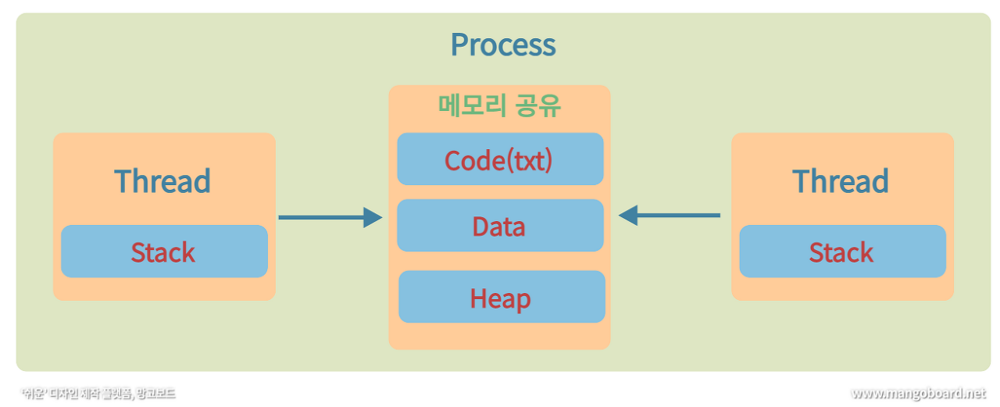

# 스레드와 프로세스

[https://kingofbackend.tistory.com/m/119](https://kingofbackend.tistory.com/m/119)

## 프로그램 이란?

- 어떤 작업을 실행할 수 있는 파일.
- 흔히 *.exe 파일

## 프로세스란?

- 컴퓨터에서 연속적으로 실행되고 있는 컴퓨터 프로그램
- 어떠한 프로그램을 실행시키기 위한 주체(인스턴스)
- 하나의 프로그램 여러개 실행 시 여러개 프로세스를 생성 하게됨.

### 프로세스 메모리 영역

- Code(txt)
- Data
- Stack
- Heap

## 프로세스 특징

- 프로세스는 각각 독립된 메모리 영역(Code, Data, Stack, Heap 구조)를 할당 받는다.
- 기본적으로 프로세스 당 최소 1개 스레드를 가진다.
- 각 프로세스는 별도의 주소공간에서 실행 (다른 프로세스에 직접 접근이 불가능하다.)
- IPC(프로세스간 통신, Inter Process Communication)을 통해 다른 프로세스에 접근 가능 (Soket 등)

→ 프로그램은 코드 덩어리 파일, 그 프로그램을 실행하게 한 것이 프로세스

# 스레드(Thread) 란?

한 프로세스 내의 여러 개의 작업을 하기위해 프로세스와 다르게 더 작은 실행 단위 인것이 스레드

## 스레드의 특징

- 프로세스의 한계를 극복하기 위해 고안된 만큼 한 프로세스 내에 있는 여러개의 스레드는 공유가 가능하다.
- 스레드는 프로세스 내에서 각각 stack 만 할당 받고, Heap 영역은 서로 공유한다.
- 같은 프로세스 내의 스레드는 같은 Heap 영역을 공유하는 반면, 다른 프로세스 메모리는 여전히 접근 불가능하다.
- 

# 프로세스 vs 스레드

- 프로세스는 IPC와 같은 통신 기법을 사용하지 않는 이상 프로세스간 접근이 불가능한 반면, 스레드는 기본구조가 Stack을 제외한 나머지 메모리 영역을 공유하기 때문에 IPC 같은 기법 없이도 자유롭게 접근이 가능하다.

## Context-Switching

멀티 프로세스 환경에서 CPU가 어떤 하나의 프로세스를 실행하고 있는 상태에서 인터럽트에 으해 다음 우선순위의 프로세스가 실행되어야 할때. 기존의 프로세스 상태 또는 레지스터 값을 저장하고 CPU가 다음 프로세스 또는 스레드를 수행하도록 새로운 프로세스의 상태 또는 레지스터 값으로 CPU에 적재하는 것

스레드 증가시 속도 느려짐

### 인터럽트

- IO 요청
- CPU 사용시간 만료
- 자식 프로세스 생성
- 인터럽트 처리 대기 시

# 멀티프로세스와 멀티스레드

멀티프로세스는 하나의 OS안에서 여러 프로세스가 도는 것.

멀티스레드는 하나의 프로세스 내에서 여러 작업을 여러 스레드를 이용하여 처리하는 것

멀티프로세스 보다 멀티 스레드 선호

→ 메모리 영역 공유 문제로.

## 멀티 스레드 장점

- 스레드 끼리 메모리 공유하고 있어 Context-Switching 시 그만큼 메모리를 절약할 수 있다.
    - 스위칭 시 스레드 스위칭을 하므로
- 메모리 영역을 공유하고 있기 때문에 응답 시간이 빠르다.
- IPC와 같은 통신기법이 필요하지 않다.

## 멀티 스레드 단점

- 메모리 영역을 공유하기 때문에 하나의 스레드에 문제 생기면 프로그램 전체에 영향을 준다.
- 메모리 영역을 공유하기 때문에 동기화 문제가 발생할 수 있음
    - 같은 데이터를 동시에 접근 사용하는 경우
- 동기화 문제를 해결해주어야함
- 설계가 어렵고, 디버깅이 까다로움

멀티 프로세스 장단점은 멀티스레드 장단점을 반대로.