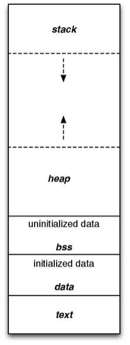

# 코드, 데이터, 스택, 힙 영역

OS에서 프로세스가 바라보는 메모리 영역은 크게 Code, Data, Heap, Stack 영역으로 나뉜다

# Code 영역

- 프로세스가 실행할 코드, 매크로 상수가 기계어의 형태로 저장된 공간.
- 컴파일 타임에 결정되며, 중간에 코드를 바꿀 수 없게 Read-only로 지정되어있음

# Data 영역

- 코드에서 전역변수, Static 변수 등이 저장
- 전역변수/Static 값을 참조한 코드는 컴파일 이후 부터는 Data 영역의 주소값을 가르키도록 바뀐다.
- 실행 도중에 전역변수 값이 변경될 수 있기에 Read-Write 로 지정되어있다.
    - ex)
    - 수정 불가 변수 들은 .rodata{} 영역에 저장
    - 수정 가능 변수 들은 .data{} 영역에 저장

# Stack 영역

- 자료구조로 많이 알려져있으나, 프로세스 메모리 공간 관리에 사용되는 알고리즘 중 하나다.
- 함수(스코프) 안에서 선언된 지역변수, 매개변수, 리턴값, 돌아올 주소 등등이 저장
- 함수 호출시 기록(push) 종료시 제거(pop) (후입선출)
- 컴파일 타임에 크기가 결정 즉, 무한히 할당 불가능
- 재귀 함수가 너무 깊게 호출되어 스택 영역 초과 시 Stack overflow

# Heap 영역

- 프로그래머가 필요 시 마다 사용하는 메모리 영역
- Code, Data, Stack 과는 다르게 런타임 시 결정된다.
- malloc, calloc 등으로 Heap 영역의 메모리를 사용할 수 있다.
- 가변 배열 등을 사용 시 Heap 영역을 사용하게 된다.
- 단, 사용 하고 난 다음에는 반드시 해제가 필요
    - 해제 안할 시 메모리 누수 발생 (memory leak)
- Stack 보다 할당 가능한 메모리 공간이 많다지만, 포인터로 메모리 영역을 접근하기 때문에 다른 자료구조에 비해 데이터 읽고 쓰기가 느리다.